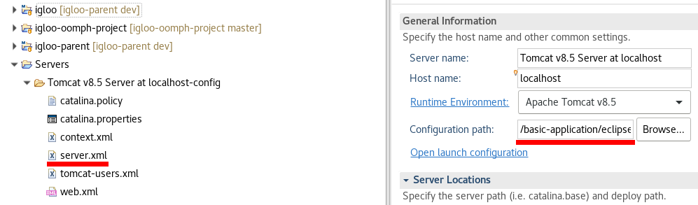

.. _jndi:

Use a JDNI datasource
=====================

A JNDI datasource can be used in place of the application managed pool.

To use a JNDI datasource:

 * Application configuration:

   * set ``db.datasourceProvider=JNDI`` in ``configuration.properties``
   * set ``db.jndiName=java:comp/env/jdbc/name`` in ``configuration.properties``;
     ``jdbc/name`` is to be replaced consistently with the name of the JNDI
     resource.

 * Container configuration (Tomcat):

   * inside server.xml > ``<Context>`` element, or in a dedicated
     or in a ``Catalina/localhost/webapp.xml``, add the resource definition.
     Adapt values to your application.

.. code-block:: xml

  <Context>
        <Resource name="jdbc/name" auth="Container" type="javax.sql.DataSource"
                username="username" password="password"
                driverClassName="org.postgresql.Driver"
                url="jdbc:postgresql://localhost:5432/database"
                maxTotal="30" maxIdle="5" />
  </Context>

In an Eclipse/WTP environment, you may modify ``server.xml`` file in the path
targetted by ``Configuration path:``. Beware that Eclipse overwrite this file
when you modify server.xml-related configurations.

   Configuration path configuration and server.xml file
